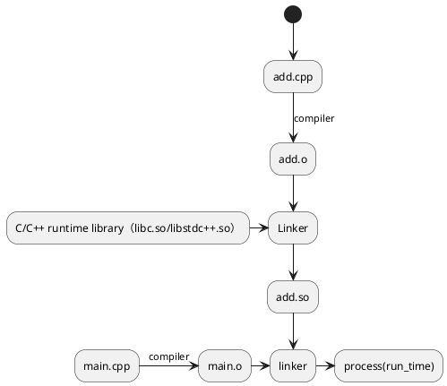
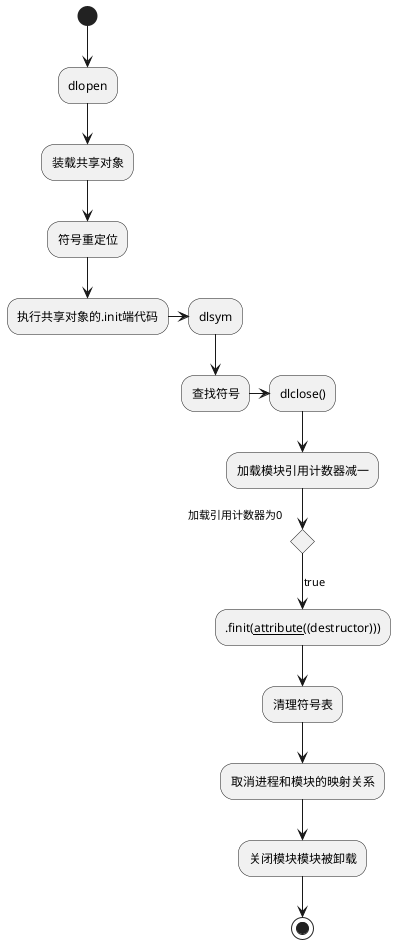
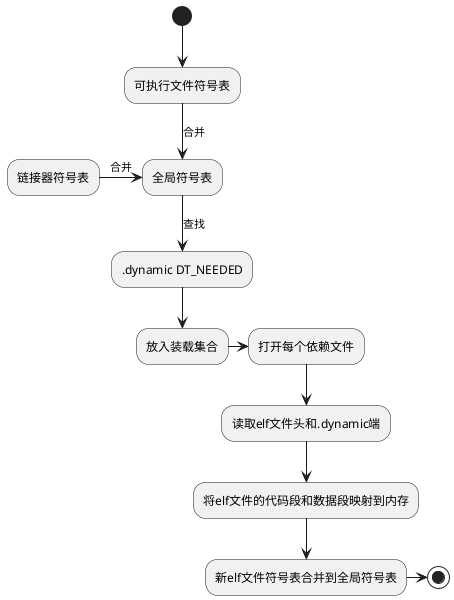
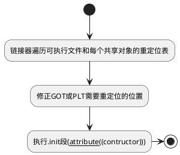

# c++动态加载
## 前提
### 静态链接和动态链接的区别
- 静态链接
  - 假如采用静态链接，两个进程proc1和proc2分别包含proc1.o和proc2.o，都依赖模块add.o；
  - 当两个进程运行时，内存里和物理磁盘里都有两份add.o；结构如下：
  ```plantuml
  @startuml
  database "memory" {
    folder "proc1_mem" {
      [proc1.o]
      [add.o]
    }
    folder "proc2_mem" {
      [proc2.o]
      [ add.o]
    }
  }
  component "physical" {
    folder "proc1_phy" {
      [ proc1.o]
      [  add.o]
    }
    folder "proc2_phy" {
      [ proc2.o]
      [   add.o]
    }
  }
  [add.o] ..> [  add.o]
  [ add.o] ..> [   add.o]
  @enduml
  ```
- 动态链接
  - 假如两个进程采用动态链接，两个进程proc1和proc2分别包含proc1.o和proc2.o，都依赖模块add.o
  - 当两个进程运行时，内存和物理磁盘里都只有一份add.o，结构如下：
  ```plantuml
  @startuml
  database "memory" {
    folder "proc1_mem" {
      [proc1.o]
    }
    folder "proc2_mem" {
      [proc2.o]
    }
    folder "libAdd.so" {
      [add.o]
    }
  }
  component "physical" {
    folder "proc1_phy" {
      [ proc1.o]
    }
    folder "proc2_phy" {
      [ proc2.o]
    }
    folder "libAdd.so_phy" {
      [ add.o]
    }
  }
  [proc1.o] ..> [ proc1.o]
  [proc2.o] ..> [ proc2.o]
  [add.o] ..> [ add.o]
  @enduml
  ```

### 动态链接好处和问题
- 节约了内存和磁盘空间，多进程可以复用同一个共享库，只占一份内存和磁盘空间【对于全局变量和静态变量，每个进程都保存了一个副本】
- 依据动态库的特性，制作插件
- 提供了跨平台的兼容性能力，保证接口一致，在不同的平台链接不同动态即可，动态链接能力，相当于在程序和操作系统之间添加了一个中间层，消除依赖差异
- 问题，当程序依赖的模块更新后，导致了新老版本不兼容问题，导致core dump；【缺少动态库的版本管理机制】

## 动态链接流程
- 例子

- 流程分析
  - 将add.cpp编译生成add.o
  - 将依赖的c/c++运行时库链接进来，生成`add.so`
  - main.cpp编译生成main.o
  - main函数依赖add.o，将add.so链接进来生成可执行文件
- 问题
  - 为什么可执行文件，在链接时要依赖add.so呢？
    - 将main.cpp编译成main.o时，编译器还不知道函数Add的地址
    - 将main.o链接成可执行文件时，链接器必须确定函数Add的性质
      - 如果是静态，则main.o需要将对Add的地址引用进行重定位
      - 如果是动态共享对象中的函数，则只是将函数标记为动态链接的符号
    - add.so中保存了完整的信息，链接器可以从中获取函数Add是一个动态符号
### 动态库运行时空间分布
#### 动态库运行时分布
```
cat /proc/5560/maps
7fb9715b0000-7fb9715b3000 rw-p 00000000 00:00 0
7fb9715c0000-7fb9715c2000 rw-p 00000000 00:00 0
7fb9715d1000-7fb9715e0000 r--p 00000000 00:00 382267             /usr/lib/x86_64-linux-gnu/libm-2.31.so
7fb9715e0000-7fb971687000 r-xp 0000f000 00:00 382267             /usr/lib/x86_64-linux-gnu/libm-2.31.so
7fb971687000-7fb97171e000 r--p 000b6000 00:00 382267             /usr/lib/x86_64-linux-gnu/libm-2.31.so
7fb97171e000-7fb97171f000 r--p 0014c000 00:00 382267             /usr/lib/x86_64-linux-gnu/libm-2.31.so
7fb97171f000-7fb971720000 rw-p 0014d000 00:00 382267             /usr/lib/x86_64-linux-gnu/libm-2.31.so
7fb971720000-7fb971745000 r--p 00000000 00:00 382032             /usr/lib/x86_64-linux-gnu/libc-2.31.so
7fb971745000-7fb9718bd000 r-xp 00025000 00:00 382032             /usr/lib/x86_64-linux-gnu/libc-2.31.so
7fb9718bd000-7fb971907000 r--p 0019d000 00:00 382032             /usr/lib/x86_64-linux-gnu/libc-2.31.so
7fb971907000-7fb971908000 ---p 001e7000 00:00 382032             /usr/lib/x86_64-linux-gnu/libc-2.31.so
7fb971908000-7fb97190b000 r--p 001e7000 00:00 382032             /usr/lib/x86_64-linux-gnu/libc-2.31.so
7fb97190b000-7fb97190e000 rw-p 001ea000 00:00 382032             /usr/lib/x86_64-linux-gnu/libc-2.31.so
7fb97190e000-7fb971912000 rw-p 00000000 00:00 0
7fb971920000-7fb971923000 r--p 00000000 00:00 382142             /usr/lib/x86_64-linux-gnu/libgcc_s.so.1
7fb971923000-7fb971935000 r-xp 00003000 00:00 382142             /usr/lib/x86_64-linux-gnu/libgcc_s.so.1
7fb971935000-7fb971939000 r--p 00015000 00:00 382142             /usr/lib/x86_64-linux-gnu/libgcc_s.so.1
7fb971939000-7fb97193a000 r--p 00018000 00:00 382142             /usr/lib/x86_64-linux-gnu/libgcc_s.so.1
7fb97193a000-7fb97193b000 rw-p 00019000 00:00 382142             /usr/lib/x86_64-linux-gnu/libgcc_s.so.1
7fb971940000-7fb9719d6000 r--p 00000000 00:00 382441             /usr/lib/x86_64-linux-gnu/libstdc++.so.6.0.28
7fb9719d6000-7fb971ac6000 r-xp 00096000 00:00 382441             /usr/lib/x86_64-linux-gnu/libstdc++.so.6.0.28
7fb971ac6000-7fb971b0f000 r--p 00186000 00:00 382441             /usr/lib/x86_64-linux-gnu/libstdc++.so.6.0.28
7fb971b0f000-7fb971b10000 ---p 001cf000 00:00 382441             /usr/lib/x86_64-linux-gnu/libstdc++.so.6.0.28
7fb971b10000-7fb971b1b000 r--p 001cf000 00:00 382441             /usr/lib/x86_64-linux-gnu/libstdc++.so.6.0.28
7fb971b1b000-7fb971b1e000 rw-p 001da000 00:00 382441             /usr/lib/x86_64-linux-gnu/libstdc++.so.6.0.28
7fb971b1e000-7fb971b21000 rw-p 00000000 00:00 0
7fb971b30000-7fb971b31000 r--p 00000000 00:00 381915             /usr/lib/x86_64-linux-gnu/ld-2.31.so
7fb971b31000-7fb971b53000 r-xp 00001000 00:00 381915             /usr/lib/x86_64-linux-gnu/ld-2.31.so
7fb971b53000-7fb971b54000 r-xp 00023000 00:00 381915             /usr/lib/x86_64-linux-gnu/ld-2.31.so
7fb971b54000-7fb971b5b000 r--p 00024000 00:00 381915             /usr/lib/x86_64-linux-gnu/ld-2.31.so
7fb971b5b000-7fb971b5c000 r--p 0002b000 00:00 381915             /usr/lib/x86_64-linux-gnu/ld-2.31.so
7fb971b5d000-7fb971b5e000 r--p 0002c000 00:00 381915             /usr/lib/x86_64-linux-gnu/ld-2.31.so
7fb971b5e000-7fb971b5f000 rw-p 0002d000 00:00 381915             /usr/lib/x86_64-linux-gnu/ld-2.31.so
7fb971b5f000-7fb971b62000 rw-p 00000000 00:00 0
7fb971b68000-7fb971b69000 r--p 00000000 00:00 38686              /mnt/d/code/code_hub/plugin_loader/build/lib/libadd.so
7fb971b69000-7fb971b6a000 r-xp 00001000 00:00 38686              /mnt/d/code/code_hub/plugin_loader/build/lib/libadd.so
7fb971b6a000-7fb971b6b000 r--p 00002000 00:00 38686              /mnt/d/code/code_hub/plugin_loader/build/lib/libadd.so
7fb971b6b000-7fb971b6c000 r--p 00002000 00:00 38686              /mnt/d/code/code_hub/plugin_loader/build/lib/libadd.so
7fb971b6c000-7fb971b6d000 rw-p 00003000 00:00 38686              /mnt/d/code/code_hub/plugin_loader/build/lib/libadd.so
7fb971b6d000-7fb971b6e000 r--p 00000000 00:00 38699              /mnt/d/code/code_hub/plugin_loader/build/bin/run_test
7fb971b6e000-7fb971b6f000 r-xp 00001000 00:00 38699              /mnt/d/code/code_hub/plugin_loader/build/bin/run_test
7fb971b6f000-7fb971b70000 r-xp 00002000 00:00 38699              /mnt/d/code/code_hub/plugin_loader/build/bin/run_test
7fb971b70000-7fb971b71000 r--p 00003000 00:00 38699              /mnt/d/code/code_hub/plugin_loader/build/bin/run_test
7fb971b72000-7fb971b73000 r--p 00004000 00:00 38699              /mnt/d/code/code_hub/plugin_loader/build/bin/run_test
7fb971b73000-7fb971b74000 rw-p 00005000 00:00 38699              /mnt/d/code/code_hub/plugin_loader/build/bin/run_test
7fffe6d7b000-7fffe6d9c000 rw-p 00000000 00:00 0                  [heap]
7fffeeb2a000-7fffef32a000 rw-p 00000000 00:00 0                  [stack]
7fffef5e7000-7fffef5e8000 r-xp 00000000 00:00 0                  [vdso]
```
- 分析
  - 进程的虚拟地址空间中，多了几个文件映射
  - 依赖的c语言运行时库libc.so和c++运行时库libstdc++.so
  - ld.so，动态链接器，程序启动时，由于依赖了Add.so等动态库，还无法直接执行，需要先将控制权交给链接器链接
  - 当依赖的库全部加载完成后，则将控制权交给run_time程序执行入口

#### 动态库结构
- 查看头信息，其中`[Requesting program interpreter: /lib64/ld-linux-x86-64.so.2]`为链接器地址
```
readelf -l ../bin/run_test

Elf file type is DYN (Shared object file)
Entry point 0x11e0
There are 13 program headers, starting at offset 64

Program Headers:
  Type           Offset             VirtAddr           PhysAddr
                 FileSiz            MemSiz              Flags  Align
  PHDR           0x0000000000000040 0x0000000000000040 0x0000000000000040
                 0x00000000000002d8 0x00000000000002d8  R      0x8
  INTERP         0x0000000000000318 0x0000000000000318 0x0000000000000318
                 0x000000000000001c 0x000000000000001c  R      0x1
      [Requesting program interpreter: /lib64/ld-linux-x86-64.so.2]
  LOAD           0x0000000000000000 0x0000000000000000 0x0000000000000000
                 0x0000000000000b58 0x0000000000000b58  R      0x1000
  LOAD           0x0000000000001000 0x0000000000001000 0x0000000000001000
                 0x00000000000013e5 0x00000000000013e5  R E    0x1000
  LOAD           0x0000000000003000 0x0000000000003000 0x0000000000003000
                 0x0000000000000e43 0x0000000000000e43  R      0x1000
  LOAD           0x0000000000004cf8 0x0000000000005cf8 0x0000000000005cf8
                 0x0000000000000320 0x0000000000000328  RW     0x1000
  DYNAMIC        0x0000000000004d18 0x0000000000005d18 0x0000000000005d18
                 0x0000000000000230 0x0000000000000230  RW     0x8
  NOTE           0x0000000000000338 0x0000000000000338 0x0000000000000338
                 0x0000000000000020 0x0000000000000020  R      0x8
  NOTE           0x0000000000000358 0x0000000000000358 0x0000000000000358
                 0x0000000000000044 0x0000000000000044  R      0x4
  GNU_PROPERTY   0x0000000000000338 0x0000000000000338 0x0000000000000338
                 0x0000000000000020 0x0000000000000020  R      0x8
  GNU_EH_FRAME   0x0000000000003054 0x0000000000003054 0x0000000000003054
                 0x00000000000002b4 0x00000000000002b4  R      0x4
  GNU_STACK      0x0000000000000000 0x0000000000000000 0x0000000000000000
                 0x0000000000000000 0x0000000000000000  RW     0x10
  GNU_RELRO      0x0000000000004cf8 0x0000000000005cf8 0x0000000000005cf8
                 0x0000000000000308 0x0000000000000308  R      0x1
```


## 运行时加载
### 整体流程


### 打开动态库dlopen
  - 装载
  - 重定位
  - 加载模块时，会执行`.init`段代码，完成模块的初始化工作
  - 参数
    - RTLD_LAZY，使用延迟绑定，即采用PLT方式处理
    - RTLD_NOW，加载是即绑定，如果有任何未定义符号没有完成绑定，dlopen报错

### 查找符号dlsym
- 基本操作
  - 如果是函数，返回函数的地址
  - 如果是变量，返回变量的地址
  - 如果是常量，返回常量的值
  - 查看符号
    - objdump -t
- 符号优先级
  - 装载优先(dlopen)：当多个同名符合冲突时，先装入的符号优先
  - 依赖序列(dlsym)：进行符号查找时，以dlopen打开的对象为根节点，进行广度优先遍历，直到找到符号位置
### 错误处理
dlerror()

### 关闭动态库
- 函数名 : dlclose()
- dlclose和dlopen相反；
- 系统维护一个加载引用计数器每次dlopen计数+1，每次close计数-1；
- 当计数减到0时，模块才被真正的卸载，执行finit("\_\_attribute\_\_((destructor))")
- 将符号从符号表中去除
- 取消进程空间和模块的映射关系，关闭模块


## 动态库加载流程
- 术语：
  - PIC：Position Independent code，地址无关代码
  - GOT: Global Offset Table，全局偏移表，Linux ELF文件中用于定位全局、静态变量和函数的一个表；【将地址相关的变量和函数放入指针数组保存；由于依赖于其他模块，在未装载前无法知道符号的偏移位置，先将依赖的符号信息保存起来，等依赖的模块装载完成，将依赖模块各个变量的地址填充进去；而模块的GOT位置是确定的，通过PC加偏移可以直接获取，因此GOT做到了指令无关，起了个中间层的作用；】
  - PLT：Procedure Linkage Table，过程链接表，Linux ELF文件中用于延迟绑定的表，即函数第一次被调用的时候才进行绑定
  - GST: Global Symbol Table，全局符号表，将会可执行文件和链接器本身的符号合并到一个符号表中；【概念剖析】
    - 其实这是一个伪概念，内存中并不存在这样一个表
    - libdl中会将所有已加载到内存中的可执行模块（主程序或动态库）的相关指针放入一个全局的链表中，通过这个全局链表可以访问到所有可执行模块的动态符号表，仅此而以
    - 我们可以假定这个全局链表是一个“全局符号表“，但其存储的内容远远不止符号表这么简单，而是可执行模块的所有相关信息，如重定位信息、代码段地址、got段地址等
 - ELF：Executable and Linkable Format，可执行可连接的格式，so，o
- 整体流程
  // todo
### 自举

- 普通的共享对象是通过动态链接器完成，动态链接器本身也是共享对象，但是他自己没有办法解释自身；
- 动态链接器限制如下
  - 动态链接器本身不依赖于其他共享对象【因为链接依赖的共享对象需要动态链接器来完成，鸡生蛋蛋生鸡问题】
  - 动态链接器本身需要的全局变量和静态变量的地址引用，以及重定位工作需要自己处理【不能使用全局变量、静态变量、不能调用自身函数，由于ld.so本身是PIC模式，内部函数和模块间函数调用一致，采用GOT/PLT方式】
- 动态链接器入口地址即自举代码入口，系统将控制权交给动态链接器时，即自举代码开始执行

### 装载
#### 流程

- 分析
  - DT_NEEDED字段包含当前可执行文件依赖的共享对象
    - `readelf -d libadd.so`
    - 也可以通过`ldd libadd.so`查看依赖

  - 查看文件头`readelf -h libadd.so`

#### 符号优先级【有例子】
- 全局符号介入：当一个符号需要加入全局符号表时，相同的符号已存在，后续的被忽略 
操作如下：
```
ldd libb1.so  // 查看依赖
ldd libb2.so
cat /proc/19057/maps //查看进程的地址空间信息
```

### 重定位和初始化


 - 链接器遍历可执行文件和每个共享对象的重定位表
 - 将他们的GOT/PLT中需要重定位的位置修正【基于全局符号表】
 - 
#### 重定位
- GOT表：
- PLT
- 问题
  - 共享模块的全局变量问题
    - 多进程，共享数据段，共享内存
    - 多线程，访问不同的全局变量副本，thread_local
#### 例子：
##### 代码
```c++
#include <iostream>
#include <string>
#include <thread>
#include "plugin_manager/plugin_manager.h"
#include "plugins/add/add.h"

typedef int (*ADD)(int x, int y);
int main()
{
    auto ret = Add(1, 2);
    while (true) {
        std::this_thread::sleep_for(std::chrono::milliseconds(2));
    }
    return 0;
}
```
##### gdb调试
```
display /20i $pc
layout split
layout asm
查看值：x /nx 0x8003fd0
```
#### 流程见附件

## 参考
- http://0x4c43.cn/2018/0429/linux-lazy-binding-mechanism/
- http://rickgray.me/2015/08/07/use-gdb-to-study-got-and-plt/
- https://blog.csdn.net/farmwang/article/details/73556572