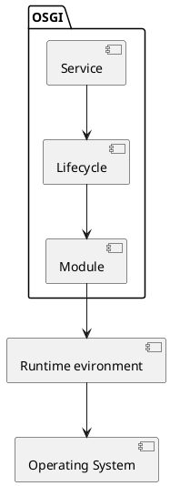
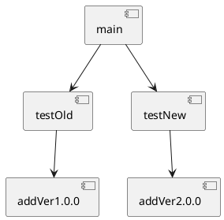

## 插件加载
- 设计思想，一个进程加载多个相同接口的插件，不同版本；
- 目标，一个进程里，相同符号可以共存，切、且都可以被调用
- 一个多版本插件共存的插件管理系统

## 组件图OSGI

- Module Layer：模块层，主要涉及包及共享的代码，包含着类的装载策略
- Lifecycle Layer：生命周期层，主要涉及插件的运行时生命周期管理，包含着动态安装、更新、卸载、开启、关闭。
- Service Layer：服务层，主要涉及模块之间的交互和通信。

## 场景

## 参考
- https://zhuanlan.zhihu.com/p/28634229
